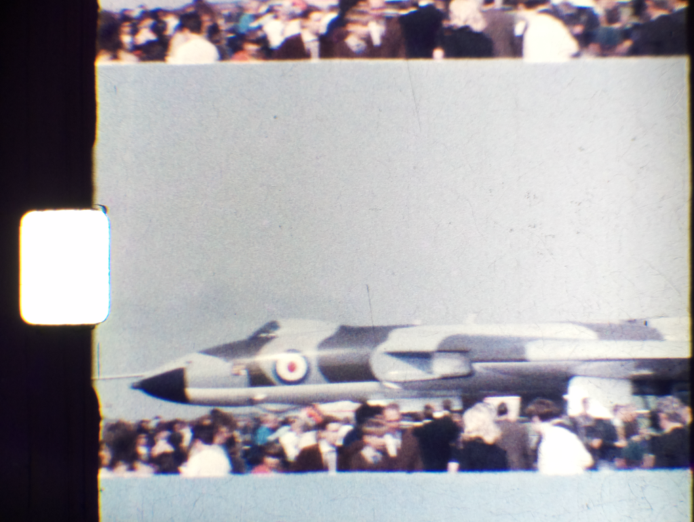
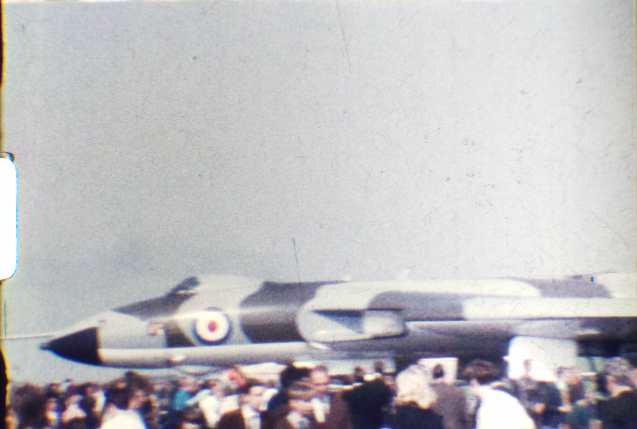
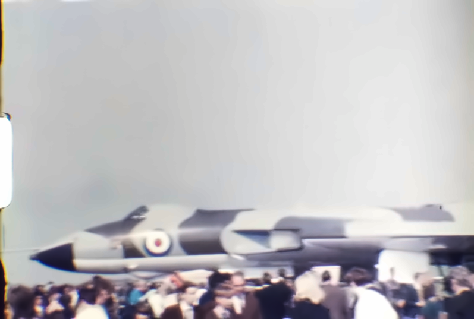

# 3D printed Super 8 Film Scanner

Using OpenCV and Open Source software to scan and create videos from Super 8 film reel, along with a 3D printed frame.

The code and scanner were created quickly to achieve the job of scanning a handful of Super 8 reels at an acceptable quality.

The code is not optimised or user friendly, but pull requests are very welcome!

The code is unlikely to run straight out of the box on your computer/system, it will need minor amendments to folder names/paths etc.


Items needed for this project:
* [Raspberry Pi 4](https://www.raspberrypi.com/products/raspberry-pi-4-model-b/)
* [Pi Advanced 12megapixel Camera](https://www.raspberrypi.com/products/raspberry-pi-high-quality-camera/)
* [Microscope lens for the Raspberry Pi High Quality Camera - 0.12-1.8x](https://shop.pimoroni.com/products/microscope-lens-0-12-1-8x)
* 3D printed frame (files in this repository)
* Two small depth stepper motors (NEMA 17 style)
* RAMPS style motherboard for controlling the stepper motors and running [MARLIN](https://github.com/MarlinFirmware/Marlin)
* Two stepper drivers (for example A4988)
* ~5000K "cool white" MR16 style LED light bulb (5 Watt)
* 240V Power supply (an old Ender3 PSU will do)
* MicroSD card

# YouTube video

See the video on how to use and build this device.

https://youtu.be/rd1Xu6e6nrw

# Setup

This is a rough setup description and some steps might be missing, but here is what's necessary:

## Step 1 - Flash Marlin to the mainboard
Flash your mainboard with the Marlin Firmware. You can find the latest release [here](https://marlinfw.org/meta/download/).

Open Arduino IDE, make the required changes (for your mainboard), connect the Mainboard via USB and upload the firmware to the Mainboard.

## Step 2 - Install RaspOS on the Raspberry Pi
Install the Raspberry Pi Imager, which you can find [here](https://www.raspberrypi.com/software/).

Plug in the microSD card into your computer and choose to install the **Legacy 32-bit OS** in the imager software. Use CTRL+SHIFT+X to open the advanced settings.  Choose a hostname, for example "scanner". Then add a username and password. Activate SSH under "services" and add your Wifi settings.

## Step 3 - Wiring
Assemble the scanner according to the 3D files.


Plug in the stepper drivers into the mainboards Y and Z axis, then plug in the stepper motors in these axis. You should add the heatsink to the Y axis stepper driver, as it's the one used the most.

Slot the Raspberry Pi HQ cameras ribbon cable into the Raspberry Pi and lock it in place. 

Plug the LED wires into the fan header. 

Connect the power supply to the mainboard via the two cables. Make sure the power supply is disconnected.

Connect the mainboard to the Raspberry Pi.

## Step 4 - Connecting to the Raspberry Pi
If you don't plan to use the scanner with dedicated monitor, keyboard and mouse, you have to connect to it via Terminal and VNC. 

Turn on the Raspberry Pi and the PSU. 

Use SSH to connect to <username>@scanner.local, then install VNC server to control your scanner in the future. If your screen stays black after connecting, run "vncserver-virtual" to add a virtual display. 

## Step 5 - Install dependencies
To install OpenCV, run `sudo apt-get update` , then `sudo apt-get install build-essential cmake pkg-config libjpeg-dev libtiff5-dev libjasper-dev libpng-dev libavcodec-dev libavformat-dev libswscale-dev libv4l-dev libxvidcore-dev libx264-dev libfontconfig1-dev libcairo2-dev libgdk-pixbuf2.0-dev libpango1.0-dev libgtk2.0-dev libgtk-3-dev libatlas-base-dev gfortran libhdf5-dev libhdf5-serial-dev libhdf5-103 python3-pyqt5 python3-dev -y`

you might also need to run `pip install opencv-python==4.5.3.56` .

# Scanning Process

## Step 1 - Capture full frame masters

On a Raspberry Pi (4 is possible), use the python code in `RasPi_Camera_Super8Scanner.py` to capture all the individual frames to individual PNG files.

This will generate a large number of files (3000+) of significant file size 2+MByte each.  Camera captures approximately 3megapixel images.

Scanning is slow, running around 1.25 frames per second, so a 3 minute reel takes 1 hour.  

Speed was not a critical issue when designing this solution, however the longest delay is capturing the image from the Raspberry Pi camera.

The images captured would look like this (only higher resolution).  Notice you can see the sproket hole and the black border on the right of the image.


## Step 2 - Alignment

Step one captured the full frame of the film, this process takes those master images and accurately crops them to vertically and horizontally align them based on the sproket hole.

OpenCV is used to detect the hole and align/crop the image.

The code is in `ImageRegistrationCropping.py` its likely you will need to tweak the code to cater for the particular file size/resolution you are using and the camera configuration.

Look for the variable `frame_dims` to control the output image dimensions.  Its likely you will also need to change the folder names.

The files are put into a folder named "Aligned".  Example image.


You can modify the provided `config.json` file to suit your needs. These are the available configurations:

```json
{
    "image_name": "frame_????????", // The name of the images to be processed
    "input_path": "Capture", // The folder where the images are stored
    "output_path": "Aligned", // The folder where the aligned images will be stored
    "extensions": ["png", "jpg", "jpeg"], // The extensions of the images to be processed
    "average_sample_count": 11, // This will be saved automatically if you run a new analysis
    "average_width": 512, // This will be saved automatically if you run a new analysis
    "average_height": 649, // This will be saved automatically if you run a new analysis
    "average_area": 306419, // This will be saved automatically if you run a new analysis
    "resize_image": [ // if you want to resize the images after alignment
        3840, // width
        2160 // height
    ],
    "frame_dims": [ // You can get this after adjusting the first frame dimensions
        0, // x offset
        -904, // y offset
        3192, // width
        2305 // height
    ]
}
```

## Step 3 - Denoise (optional)

A post process called de-noise filtering can be used to improve image quality.  This code can be found in `Denoise.py`

This is a significantly slow process, so a faster CPU helps a lot.  You can tweak the amount of correction made with these values

```
h=3, hColor=3, templateWindowSize=7,searchWindowSize=29
```

For a description of the paramters, check out the [OpenCV documentation](https://docs.opencv.org/3.4/d1/d79/group__photo__denoise.html#gaa501e71f52fb2dc17ff8ca5e7d2d3619).

The files are put into a folder named "Denoise".  Example image.


## Step 4 - Create Video

### FFMPEG
You can use the open source FFMPEG tool to convert a series of pictures into a video, using a command similar to this:
```
ffmpeg.exe -y -start_number 0 -framerate 18 -i "Aligned\frame_%08d.png" -vcodec h264 -preset slower -tune grain -crf 15 -vf "fps=18,format=yuv420p" -r 18 film_output.mp4
```

### Video editor software
Alternatively, use video editing software like [Davinci Resolve](https://www.blackmagicdesign.com/products/davinciresolve/) to import the pictures and generate a video.

This can also be used to colour correct the film, remove noise and grain and generally improve the final video.
